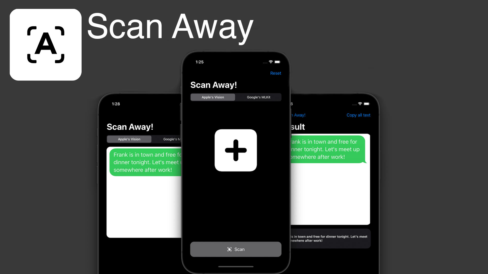

# Scan Away!
### iOS App for text recognition using Apple's Vision framework and Google's MLKit.
## Installation
Make sure to delete the pod folder and run 
```
pod install
```
Before actually running or building the project or you can just unzipping the file
```
Pods/MLKitTextRecognition/Frameworks/MLKitTextRecognition.framework/MLKitTextRecognition.zip
```
Scan Away is an app built entirely in swift targetting iOS 14+ iPhones. The UI is built programmatically without the use of storyboards. 
Technologies used:
- Apple's Vision framework for Text Recognition
- Google's MLKit for Text Recognition

## Screenshots




